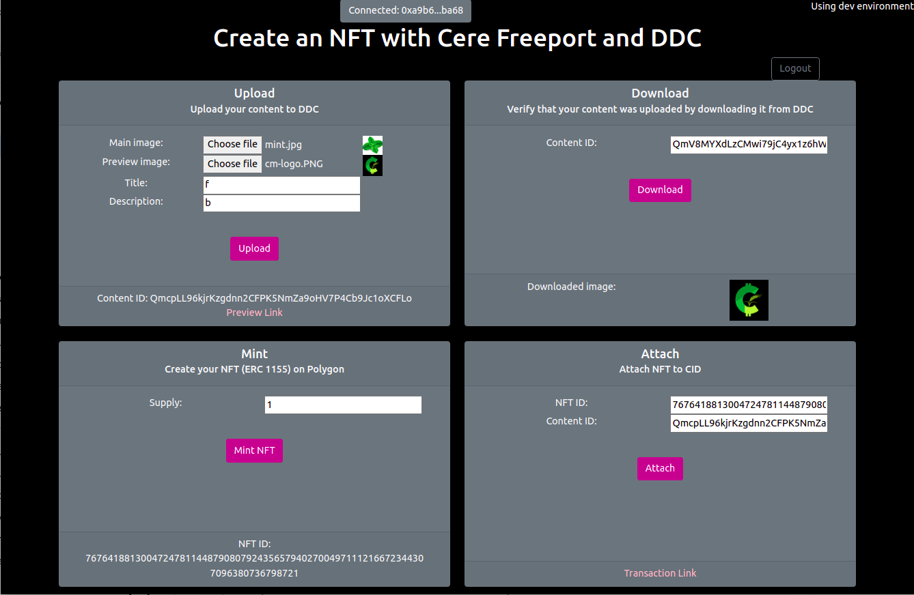

# Minting NFTs on Polygon with Cere Freeport
In this tutorial, you'll learn how to connect a React frontend to Cere Freeport's smart contracts using Metamask and the Freeport SDK. You will learn how to:

* Setup a metamask-based login session with Cere DDC Gateway
* Upload asset image files to Cere's DDC.
* Locate and download this asset from Cere's DDC.
* Mint NFTs using Cere Freeport.
* Attach the content to the NFT.

Here's what your final product will look like.



# Function Naming Conventions

Each of the rectangular panels - upload, download, etc - is a react component that implements the UI for the respective functionality. The panels are named as `Panelxxx`, e.g. `PanelMetamaskLogin`, `PanelUpload`, etc.

Different button click callbacks are named as onXXXPressed where XXX is the button name. For example, `onLoginPressed`, `onUploadPressed` etc.

# The Overall Flow

The process of minting NFTs generally involves 3 steps:

1. The Freeport ERC-1155 smart contract must be instantiated on the blockchain.  This is done by caling the `issue` function on the smart contract.
2. The corresponding digital content must be uploaded and stored somewhere. Preferably in a decentralized fashion such as Cere DDC. When you upload a content, Cere DDC securely stores the content and returns a content ID (CID) that represents the content.
3. The content is attached to the token. Cere Freeport NFT contracts allow attaching one or more digital content to an NFT.

Cere Freeport and DDC SDKs simplify the above steps.  The following sections guide you through this process.

# Getting set up

## Pre-requisites
The following are required to build this tutorial:

- Metamask wallet extension in your browser
- Node and NPM installation on your computer

## Getting Testnet MATIC in your wallet

This tutorial uses `Mumbai` Polygon test network to mint tokens. You first need to setup access to this network in metamask and get some Matic tokens to pay gas fees for transactions.

### Add Mumbai Test Network to your Metamask wallet
Mumbai is not enabled by default in Metamask. You will have to add it as one of the connected networks manually if it isn't already. Here's a [guide](https://blog.pods.finance/guide-connecting-mumbai-testnet-to-your-metamask-87978071aca8) to do that.

### Getting testnet Matic tokens in your wallet
You'll need some testnet Matic tokens going forward. Polygon provides a "faucet" service to get some free test tokens.

* Navigate to [https://faucet.polygon.technology/](https://faucet.polygon.technology/)
* Click on the Mumbai Testnet tab.
* Enter your wallet address and click submit.

You should receive some testnet matic tokens after a minute.

## Installing dependencies and starting your project

First, clone this repository to your local environment. It contains two folders:
* `starter-files`: contains the starter files which include the React UI and the code to connect to Metamask. These are the files we'll be editing in this tutorial.
* `freeport-nft-minter`: contains the completed tutorial.

Before starting, we must install some libraries, including the Cere Freeport SDK. In a terminal, navigate to the `starter-files` folder and run the following command:

    npm install

Once these have finished installing, run the following command in the `starter-files` directory

    npm start

If a browser does not open automatically, open one and navigate to [http://localhost:3000/](http://localhost:3000/). Here you'll see the frontend of your project. These are the functionalities that you will be implementing.

 # The files you'll be working on

Open the following two files:


1. `src/actions.js`: this file contains the functions we need for interacting with our Metamask wallet, the Freeport smart contract and the DDC.
2. `src/Main.js`: this file contains the user inferface and the functions required to tie the two files together.

Now let's start coding! Each code block below is preceeded by a header representing the function you're editing and its corresponding file name in [brackets].

# Connecting to your Metamask wallet

## `1. connectWallet [actions.js]`

```javascript
export const connectWallet = async () => {
  // Check if window.ethereum is enabled in your browser (i.e., metamask is installed)
  if (window.ethereum) {
    try {
      // Prompts a metamask popup in browser, where the user is asked to connect a wallet.
      const addressArray = await window.ethereum.request({method: "eth_requestAccounts"});
      // Return an object containing a "status" message and the user's wallet address.
      return { status: "Follow the steps below.", address: addressArray[0] };
    } catch (err) { return { address: "", status: err.message}; }
    // Metamask injects a global API into websites visited by its users at 'window.ethereum'.
    // If window.ethereum is not enabled, then metamask must not be installed.
  } else { return { address: "", status: "Please install the metamask wallet" }; }
};
```

## `2. getCurrentWalletConnected [actions.js]`
```javascript
export const getCurrentWalletConnected = async () => {
  if (window.ethereum) {
    try {
      // Get the array of wallet addresses connected to metamask
      const addressArray = await window.ethereum.request({ method: "eth_accounts" });
      // If it contains at least one wallet address
      if (addressArray.length > 0) {
        return { address: addressArray[0], status: "Follow the steps below." };
        // If this list is empty, then metamask must not be connected.
      } else { return { address: "", status: "Please connect to metamask." }; }
      // Catch any errors here and return them to the user through the 'status' state variable.
    } catch (err) { return { address: "", status: err.message }; }
    // Again, if window.ethereum is not enabled, then metamask must not be installed.
  } else { return { address: "", status: "Please install the metamask wallet" }; }
};
```

## `3. addWalletListner [Main.js]`
Update the UI when wallet state changes, e.g. when user adds an account, switching between accounts, or disconnects their account.
```javascript
function addWalletListener() {
  // Check if metamask is installed
  if (window.ethereum) {
      // Listen for state changes in the metamask wallet such as:
      window.ethereum.on("accountsChanged", (accounts) => {
        // If there is at least one account,
        if (accounts.length > 0) {
          // then update the state variables 'walletAddress' and 'status'
          setWalletAddress(accounts[0]);
          setStatus("Follow the steps below.");
        // If metamask is installed but there are no accounts, then it must not be connected.
        } else { setStatus("Connect to Metamask using the top right button."); }
      });
    // If metamask is not installed, then ask them to install it.
  } else { setStatus("Please install metamask and come back"); }
};
```


## ` 4. connectWalletPressed [Main.js]`
```javascript
const connectWalletPressed = async () => {
  // Call our connectWallet function from the previous step and await response.
  const { status, address } = await connectWallet();
  setStatus(setStatus);
  setWalletAddress(address);
};
```


## ` 5. useEffect [Main.js]`
`useEffect()` is a React hook that is called after the component is rendered. It accepts 2 arguments: `callback` the function containing the side-effect logic that executes right after changes are pushed to DOM, and `dependencies`, which control when you want this logic to run. The `useEffect()` executes `callback` only if `dependencies` have changed between renderings. We leave the `dependencies` array empty to execute this logic on the first render only. Because it's empty, the condition to re-execute the `callback` logic will never be met again.

```javascript
useEffect(async () => {
  // The 'callback' side-effect logic
  const {address, status} = await getCurrentWalletConnected();
  setWalletAddress(address)
  setStatus(status);
  addWalletListener();
  // The 'dependencies' array
}, []);
```

# Login to the DDC Gateway using Metamask


# Uploading your asset to DDC

## `1. upload2DDC [actions.js]`

This function makes an HTTP post request to the Cere DDC API, followed by a series of HTTP get requests (max 3) to obtain the upload status of your asset. The HTTP post request requires your wallet address, your wallet's public encryption key, a signed authentication message, and of course the asset along with it's associated title and description. The function then returns a CID for the content you uploaded.


```javascript
export const upload2DDC = async (gatewayUrl, sessionToken, minter, minterEncryptionKey, data, preview, title, description) => {
    const uploadData = {
        minter, // Owner address
        file: data, // binary file
        preview,
        minterEncryptionKey, // Minter encryption key
        title, // Asset title
        description //Descriptive text
    };
    const uploadUrl = `${gatewayUrl}/assets/v2`;
    const httpRes = await upload(uploadUrl, uploadData, sessionToken);
    const contentId = httpRes.data;
    const previewUrl = `${gatewayUrl}/assets/v2/${minter}/${contentId}/preview`;
    return {contentId, previewUrl, status: "Upload successful"};
};

```

## `2. onUploadPressed [Main.js]`

This function simply calls the upload2DDC function and sets the state variables status and uploadOutput with the CID it returns. The status and CID are then printed to your browser to serve as inputs for the functions below.

This function simply calls the `upload2DDC` function and sets a number of state variables such as `status` and `uploadOutput` with the values it returns (used for display purposes).

```javascript
  const onUploadPressed = async () => {
    setCid(null);
    try {
      setUploadOutput("Uploading...");
      setPreviewUrl(null);
      setCid(null);
      const { contentId, previewUrl, status } = await upload2DDC(
          DDC_GATEWAY, /* Server Address */ 
          sessionToken, /* Session token */
          minter,  /* User wallet */
          minterEncryptionKey,  /* User's public encryption key */
          uploadData, /* main image file to upload */
          previewData, /* Preview image file */
          uploadDataTitle, /* Human readable title */
          uploadDataDescription /* Human readable description of this data */
      );
      setStatus(status);
      setPreviewUrl(previewUrl);
      setCid(contentId);
      setUploadOutput("Content ID: " + contentId);
    } catch (error) {
      setUploadOutput("" + error);
    }
  }
```

# Downloading your asset from DDC

## `1. downloadFromDDC [actions.js]`

This function makes an HTTP get request to the Cere DDC API to download the asset you just uploaded by providing it with its CID. Similar to the upload2DDC function, you will need to provide your wallet address and a signed authentication message to acceess this content on DDC.


```javascript
export const downloadFromDDC = async (gatewayUrl, sessionToken, provider, minter, contentId) => {
  const signer = provider.getSigner();
  // Wait one second.
  await sleepFor(1);
  // Create the signature 
  const signature = await signer.signMessage(`${minter}${contentId}${minter}`); 
  // Construct a set of key/value pairs representing the fields required by the Cere DDC API. 
  const headers = { 
    'X-DDC-Signature': signature, 
    'X-DDC-Address': minter,
    Authorization: `Bearer ${sessionToken}`
  };
  const downloadUrl = `${gatewayUrl}/assets/v2/${minter}/${contentId}/content`;
  const results = await httpGet(downloadUrl, {
      responseType: 'blob',
      headers
  });
  // Return the downloaded data
  return { status: "Download complete.", content: results.data };
};
```

## `2. onDownloadPressed [Main.js]`

This function simply calls the downloadFromDDC function and sets the state variables status and downloadedImage with the content (e.g., image) that is returned. The downloadedImage and status are then displayed in your browser to confirm that your download was sucessful.

```javascript
  const onDownloadPressed = async () => {
    setDownloadedImage(null);
    const { status, content} = await downloadFromDDC(DDC_GATEWAY, sessionToken, provider, minter, cid);
    setStatus(status);
    setDownloadedImage(URL.createObjectURL(content));
  };
```

# Minting your NFT


## `1. mintNFT [actions.js]`

The mintNFT function takes two input parameters: quantity, the number of NFT's you would like to mint, and metadata, a string that will be permanently attached to your NFT. It then calls the issue() function of the Freeport smart contract and returns an nftId and a status.

```javascript
export const mintNFT = async (quantity, metadata) => {
  // Do not allow the user to mint an NFT without metadata. Must not be empty string. 
  if (metadata.trim() === "" || (quantity < 1)) { return { success: false, status: "Please complete all fields before minting." } }
  // Create a new provider, which is an abstraction of a connection to the Ethereum network.
  const provider = importProvider();
  // Select 'dev', 'stage', or 'prod' environment to determine which smart contract to use. Default is 'prod'.
  const env = API_ENV;
  // Get the appropriate Freeport contract address, based on environment selected above.
  const contractAddress = await getFreeportAddress(provider, env);
  console.log("CA", contractAddress)
  // Create an instance of the Freeport contract using the provider and Freeport contract address
  const contract = createFreeport( { provider, contractAddress } );
  console.log("freeport contract ", contract);
  try {
    // Call the issue() function from the Freeport smart contract.
    const tx = await contract.issue(quantity, utilStr2ByteArr(metadata));
    const receipt = await tx.wait();
    const nftId = receipt.events[0].args[3].toString(); 
    // Return the transaction hash and the NFT id.  
    return { status: "Minting complete.", tx: tx.hash, nftId: nftId }
    // If something goes wrong, catch that error. 
  } catch (error) { return { status: "Something went wrong: " + error.message }; }
};

```
## `2. onMintPressed [Main.js]`

This function simply calls the mintNFT function and sets the state variables status and mintOutput with the nftId that is returned. The nftId and status are then displayed in your browser to confirm that the minting process was sucessful.

```javascript
  const onMintPressed = async () => {
    setMintOutput("Creating NFT...");
    const { tx, nftId, status } = await mintNFT(+qty, metadata)
    setStatus(status);
    setMintOutput("NFT ID: " + nftId);
  };

```


# Attaching your asset to your NFT

## `1. attachNftToCid [actions.js]`

The attachNftToCid function takes two input parameters: nftId, a unique identifier of your NFT, and the CID of the asset you uploaded to Cere DDC. It then calls the attachToNft function from the Freeport createNFTAttachment smart contract and creates a mapping from the NFT you minted to your asset on DDC.

```javascript
export const attachNftToCid = async (nftId, cid) => {
  // Do not allow the user call this function without a nftId and cid 
  if ( !nftId || !cid) { return { success: false, status: "Please complete all fields before attaching." } }
  // Create a new provider, which is an abstraction of a connection to the Ethereum network.
  const provider = importProvider();
  // Select 'dev', 'stage', or 'prod' environment to determine which smart contract to use. Default is 'prod'.
  const env = API_ENV;
  // Get the appropriate Freeport contract address, based on environment selected above.
  const contractAddress = await getNFTAttachmentAddress(provider, env);
  // Create an instance of the Freeport contract using the provider and Freeport contract address
  const contract = createNFTAttachment({ provider, contractAddress });
  // You need 46 bytes to store a IPFS CID.
  // If you express it in hexadecimal, it becomes 34 bytes long (68 characters with 1 byte per 2 characters).
  // However, the first two characters of the hexadecimal represent the hash function being used.
  // Since that's the only format that IPFS uses, 
  // we drop this information and obtain a 32 byte long value that fits in a bytes32 fixed-size byte array.
  const bytes32FromIpfsHash = "0x"+bs58.decode(cid).slice(2).toString('hex');
  try {
    // Call the attachToNFT() function from the CreateNFTAttachment smart contract.
    const tx = await contract.attachToNFT(nftId, bytes32FromIpfsHash);
    // Return the transaction hash of this attachement.  
    return { success: true, status: "NFT and CID attached.", tx: tx.hash };
    // If something goes wrong, catch that error. 
  } catch (error) { return { success: false, status: "Something went wrong: " + error.message }; }
};

```

## `2. onAttachPressed [Main.js]`

This function simply calls the attachNftToCid function and sets the state variable status and the state variable attachOutput with a clickable link to the NFT-asset attachment transaction.

```javascript
  const onAttachPressed = async () => {
    setAttachOutput("Attaching content to NFT...");
    const { status, tx } = await attachNftToCid(nftId, cid);
    setStatus(status);
    setAttachOutput(<a href={"https://mumbai.polygonscan.com/tx/"+tx}>Transaction Link</a>)
  };
```

# Transfering your NFT

The `transfer` function uses the standard ERC 1155's `safeTransferFrom` function to a different user.

```javascript
export const transfer = async (env, to, nftId) => {
    const provider = importProvider();
    const contractAddress = await getFreeportAddress(provider, env);

    // Contract object
    const contract = createFreeport({
        provider,
        contractAddress
    });

    // find from address
    const accounts = await provider.provider.request({ method: 'eth_requestAccounts' });
    const from = accounts[0];


    const tx = await contract.safeTransferFrom(from, to, nftId, 1, [0]);
    const receipt = await tx.wait();
    console.log(receipt);

    return tx;
};
```

# Conclusion

Congratulations! You've completed the tutorial. Now you can upload an asset to Cere DDC, mint an NFT and attach them to one another using Cere Freeport.

